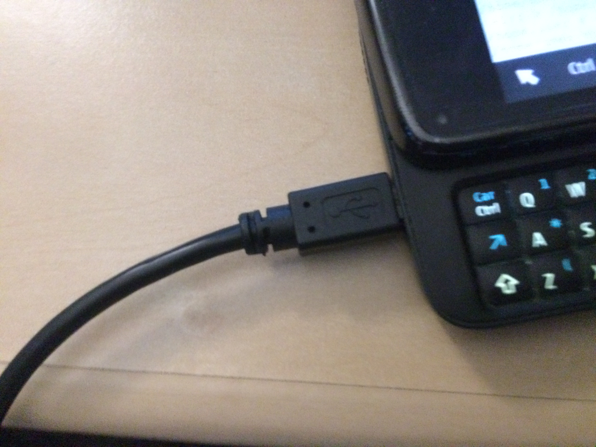
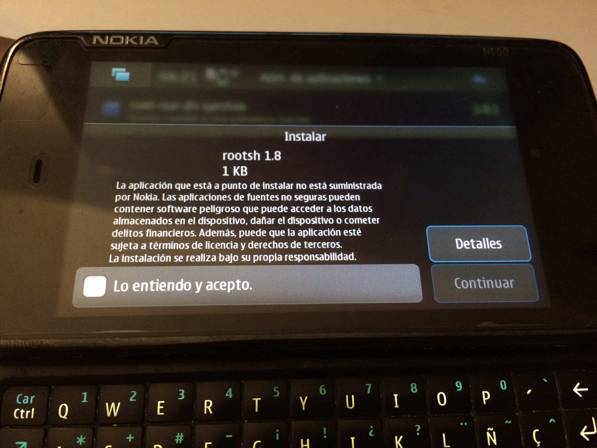
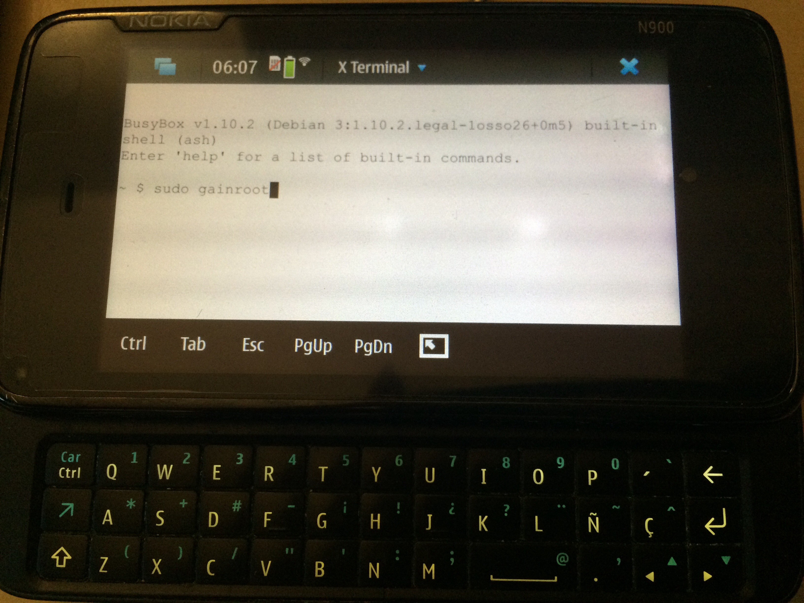
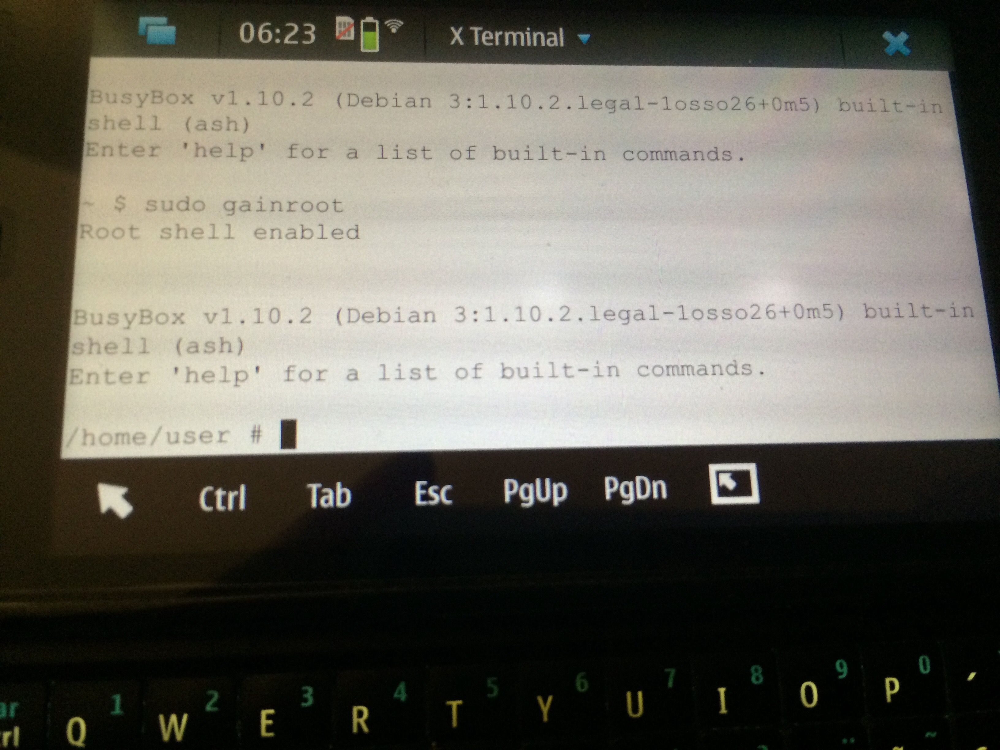
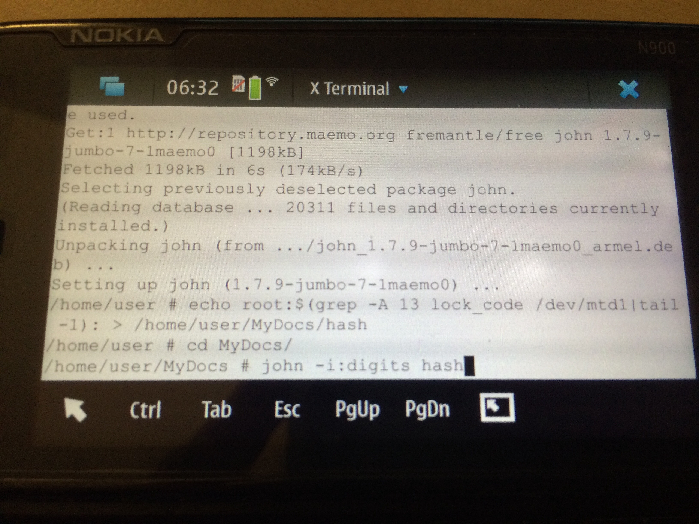
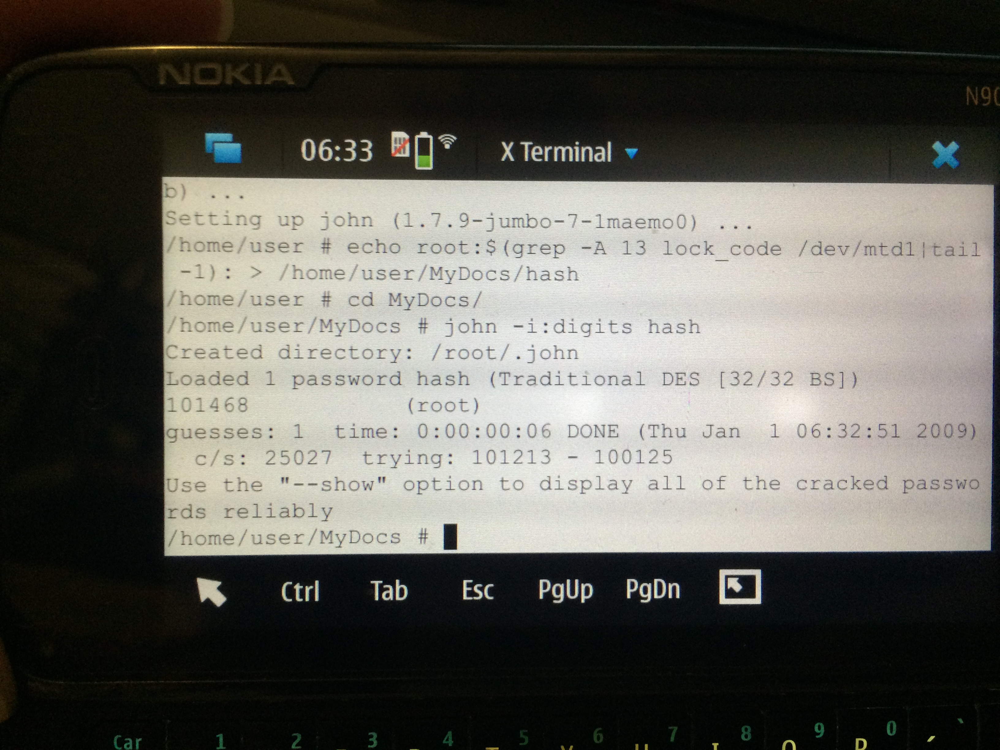

# Nokia N900 PIN security code bypass

Some time ago I got my Nokia N900 forgotten in a box. But I had a problem, I'd forgotten the PIN code.

To start using the phone needed to put the PIN code but was unable to recover. Unfortunately, there are not many operating systems that allow for the N900 bypass this security protection.

Since Microsoft bought Nokia, Nokia's repositories have been disappearing slowly at internet, so the task of recovering the phone would become more difficult, you have to use mirrors or can download from my repository ..

Then I explain the details of the actions to take :)

(I've used ubuntu for this example)

**IMPORTANT:**  Your N900 battery needs to be full charged = 🔋100% 

# Your tools

First, download and install maemo flasher <i>maemo_flasher-3.5_2.4.5.3_beta_i386.deb</i>

	http://lynk.my/1164/int/http://maemo-repos.com/apt-mirror/tablets-dev/maemo_flasher-3.5_2.4.5.3_beta_i386.deb

<pre>nlago@luna: ~/Downloads/N900$ sudo dpkg -i maemo_flasher-3.5_2.5.2.2_i386.deb  
Seleccionando el paquete flasher-3.5:i386 previamente no seleccionado. 
(Leyendo la base de datos ... 209368 ficheros o directorios instalados actualmente.) 
Preparando para desempaquetar maemo_flasher-3.5_2.5.2.2_i386.deb ... 
Desempaquetando flasher-3.5:i386 (2.5.2.2) ... 
dpkg: problemas de dependencias impiden la configuración de flasher-3.5:i386: 
flasher-3.5:i386 depende de libusb-0.1-4 (>= 2:0.1.12). 

dpkg: error al procesar el paquete flasher-3.5:i386 (--install): 
problemas de dependencias - se deja sin configurar 
Procesando disparadores para man-db (2.7.4-1) ... 
Se encontraron errores al procesar: 
flasher-3.5:i386
</pre>

When I tried to install, I found several problems with debian dependences, so install <i>libusb-0.1-4</i>:

You can download from: <pre>
https://packages.debian.org/jessie/amd64/libusb-0.1-4/download</pre>

<pre>nlago@luna: ~/Downloads/N900$ sudo dpkg -i libusb-0.1-4_0.1.12-25_amd64.deb
dpkg: aviso: desactualizando libusb-0.1-4:amd64 de 2:0.1.12-27 a 2:0.1.12-25 
(Leyendo la base de datos ... 209374 ficheros o directorios instalados actualmente.) 
Preparando para desempaquetar libusb-0.1-4_0.1.12-25_amd64.deb ... 
Desempaquetando libusb-0.1-4:amd64 (2:0.1.12-25) sobre (2:0.1.12-27) ... 
Configurando libusb-0.1-4:amd64 (2:0.1.12-25) ... 
Procesando disparadores para libc-bin (2.21-0ubuntu4) ...
Configurando libusb-0.1-4:amd64 (2:0.1.12-25) ... 
Procesando disparadores para libc-bin (2.21-0ubuntu4) ...
</pre>

After installed the mamemo flasher, you can start /* uf..! 😅*/

# Flash your N900 (version required)

Download the kernel <i>RX-51_2009SE_1.2009.41-1.VANILLA_PR_EMMC_MR0_ARM.bin</i>

	http://web.archive.org/web/20131117073524/http://skeiron.org/tablets-dev/nokia_N900/

<b>IMPORTANT:</b> Only this VANILLA version permits roots!

<pre>
16:15:39 nlago@luna: ~/Downloads/N900$ sudo flasher-3.5 -F RX-51_2009SE_1.2009.41-1.VANILLA_PR_EMMC_MR0_ARM.bin -f 
flasher v2.5.2 (Oct 21 2009) 

Image 'mmc', size 241163 kB 
       Version RX-51_2009SE_1.2009.41-1.VANILLA 
Suitable USB device not found, waiting.
</pre>

When you run it, you have to connect your N900 on your pc USB while you keep pressing the `U` letter key from your N900 keyboard.

<pre>
If you don't connect right your N900 you will get the next error:

<pre>
16:17:23 nlago@luna: ~/Downloads/N900$ sudo flasher-3.5 -F RX-51_2009SE_1.2009.41-1.VANILLA_PR_EMMC_MR0_ARM.bin -f 
flasher v2.5.2 (Oct 21 2009) 

Image 'mmc', size 241163 kB 
       Version RX-51_2009SE_1.2009.41-1.VANILLA 
Suitable USB device not found, waiting. 
USB device found found at bus 001, device address 022. 
Using flashing protocol Mk II. 
SU_VERIFY_COMMS_REQ timed out.
</pre>
Let's try again :)
</pre>

<pre>
16:35:39 nlago@luna: ~/Downloads/N900$ sudo flasher-3.5 -F RX-51_2009SE_1.2009.41-1.VANILLA_PR_EMMC_MR0_ARM.bin -f 
flasher v2.5.2 (Oct 21 2009) 

Image 'mmc', size 241163 kB 
       Version RX-51_2009SE_1.2009.41-1.VANILLA 
Suitable USB device not found, waiting.
</pre>

<b>Connect your N900 on your pc USB while you press the letter U from your N900 keyboard. </b>

<pre>
16:39:37 nlago@luna: ~/Downloads/N900$ sudo flasher-3.5 -F RX-51_2009SE_1.2009.41-1.VANILLA_PR_EMMC_MR0_ARM.bin -f 
flasher v2.5.2 (Oct 21 2009) 

Image 'mmc', size 241163 kB 
       Version RX-51_2009SE_1.2009.41-1.VANILLA 
Suitable USB device not found, waiting. 
USB device found found at bus 001, device address 031. 
Found device RX-51, hardware revision 2104 
NOLO version 1.4.14 
Version of 'sw-release': RX-51_2009SE_20.2010.36-2_PR_MR0 
Booting device into flash mode. 
Suitable USB device not found, waiting. 
USB device found found at bus 001, device address 032. 
Raw data transfer EP found at EP2. 
Image(s) flashed successfully in 25.732 s (9371 kB/s
</pre>

Now, you have installed your mmc on your N900.  

<b>IMPORTANT</b>: In order to continue, you have to remove the battery from your N900.

After that, you have to install the kernel. In this case: <i>RX-51_2009SE_1.2009.42-11_PR_COMBINED_MR0_ARM.bin </i> 

Run on your terminal:
<pre> 16:41:47 nlago@luna: ~/Downloads/N900$ sudo flasher-3.5 -F RX-51_2009SE_1.2009.42-11_PR_COMBINED_MR0_ARM.bin -f -R   
</pre>

Connect your N900 on your pc USB, install again the battery and turn on your N900 while pressing the letter U from your N900 keyboard.

<pre>
16:41:47 nlago@luna: ~/Downloads/N900$ sudo flasher-3.5 -F RX-51_2009SE_1.2009.42-11_PR_COMBINED_MR0_ARM.bin -f -R   
flasher v2.5.2 (Oct 21 2009) 

SW version in image: RX-51_2009SE_1.2009.42-11_PR_MR0 
Image 'kernel', size 1700 kB 
       Version 2.6.28-20094102.3+0m5 
Image 'rootfs', size 149376 kB 
       Version RX-51_2009SE_1.2009.42-11_PR_MR0 
Image 'cmt-2nd', size 81408 bytes 
       Version 8.2.2009.34.3-2+0m5 
Image 'cmt-algo', size 519808 bytes 
       Version 8.2.2009.34.3-2+0m5 
Image 'cmt-mcusw', size 5786 kB 
       Version 8.2.2009.34.3-2+0m5 
Image '2nd', size 14720 bytes 
       Valid for RX-51: 2217, 2218, 2219, 2220, 2120 
       Version 1.4.13+0m5 
Image 'xloader', size 14848 bytes 
       Valid for RX-51: 2217, 2218, 2219, 2220, 2120 
       Version 1.4.13+0m5 
Image 'secondary', size 109440 bytes 
       Valid for RX-51: 2217, 2218, 2219, 2220, 2120 
       Version 1.4.13+0m5 
Image '2nd', size 14720 bytes 
       Valid for RX-51: 2101, 2102, 2103 
       Version 1.4.13+0m5 
Image 'xloader', size 14848 bytes 
       Valid for RX-51: 2101, 2102, 2103 
       Version 1.4.13+0m5 
Image 'secondary', size 109440 bytes 
       Valid for RX-51: 2101, 2102, 2103 
       Version 1.4.13+0m5 
Image '2nd', size 14720 bytes 
       Valid for RX-51: 2104, 2105, 2106, 2107, 2108, 2109, 2110, 2111, 2112, 2113, 2114, 2115, 2116, 2117, 2118, 2119 
       Version 1.4.13+0m5 
Image 'xloader', size 14848 bytes 
       Valid for RX-51: 2104, 2105, 2106, 2107, 2108, 2109, 2110, 2111, 2112, 2113, 2114, 2115, 2116, 2117, 2118, 2119 
       Version 1.4.13+0m5 
Image 'secondary', size 109440 bytes 
       Valid for RX-51: 2104, 2105, 2106, 2107, 2108, 2109, 2110, 2111, 2112, 2113, 2114, 2115, 2116, 2117, 2118, 2119 
       Version 1.4.13+0m5 
Image '2nd', size 14720 bytes 
       Valid for RX-51: 2201, 2202, 2203, 2204, 2205, 2206, 2207, 2208, 2209, 2210, 2211, 2212, 2213, 2214, 2215, 2216 
       Version 1.4.13+0m5 
Image 'xloader', size 14848 bytes 
       Valid for RX-51: 2201, 2202, 2203, 2204, 2205, 2206, 2207, 2208, 2209, 2210, 2211, 2212, 2213, 2214, 2215, 2216 
       Version 1.4.13+0m5 
Image 'secondary', size 109440 bytes 
       Valid for RX-51: 2201, 2202, 2203, 2204, 2205, 2206, 2207, 2208, 2209, 2210, 2211, 2212, 2213, 2214, 2215, 2216 
       Version 1.4.13+0m5 
USB device found found at bus 001, device address 038. 
Found device RX-51, hardware revision 2104 
NOLO version 1.4.14 
Version of 'sw-release': RX-51_2009SE_20.2010.36-2_PR_MR0 
Sending xloader image (14 kB)... 
100% (14 of 14 kB, avg. 3625 kB/s) 
Sending secondary image (106 kB)... 
100% (106 of 106 kB, avg. 15267 kB/s) 
Flashing bootloader... done. 
Sending cmt-2nd image (79 kB)... 
100% (79 of 79 kB, avg. 13250 kB/s) 
Sending cmt-algo image (507 kB)... 
100% (507 of 507 kB, avg. 25381 kB/s) 
Sending cmt-mcusw image (5786 kB)... 
100% (5786 of 5786 kB, avg. 29672 kB/s) 
Flashing cmt-mcusw... done. 
Sending kernel image (1700 kB)... 
100% (1700 of 1700 kB, avg. 22984 kB/s) 
Flashing kernel... done. 
Sending and flashing rootfs image (149376 kB)... 
100% (149376 of 149376 kB, avg. 15763 kB/s) 
Finishing flashing... done 
CMT flashed successfully

</pre>

Now, wait until your N900 starts. (You can disconnect your N900 from your USB)

### N900 interface:

Add a new repository on your N900:

	Application menu
	Select Application catalogs 
	Select New 
	Enter a catalog name of Maemo extras-devel 
	Enter a web address of http://repository.maemo.org/extras-devel/ 
	Enter a distribution of fremantle 
	Enter components of free non-free 
	Select Save
	 
Now, open a x-terminal on your N900 ant install ``rootsh``

Install rootsh with your Application manager:

Open a terminal and get root:
<pre>
sudo gainroot
</pre>

Install John to get your PIN CODE forgotten:
<pre>
apt-get install john
</pre>

Extract the hash to the file. I used the directory /home/user/MyDocs/hash for example

<pre>
echo root:$(grep -A 13 lock_code /dev/mtd1|tail -1): > /home/user/MyDocs/hash
</pre>

And get the code:
<pre>
cd /home/user/MyDocs/hash
john -i:digits hash
</pre>

Now you have the code in order to set up your N900, in my case, `101468`

But we have a problem: N900 is still in <i>RD mode</i>. It means that you have all the features on your mobile, except GSM coverage.

This version allows to bypass your  PIN CODE, but It fails when you have to left your N900 from the RD mode.

What can i do to solve it?

## Flash your N900

Turn off your N900.

Download a new eMMC <i>RX-51_2009SE_10.2010.13-2.VANILLA_PR_EMMC_MR0_ARM.bin</i> and repeat the process with the new (and last) eMMC:

### Step 1:
Connect your N900 on your pc USB, install again the battery and turn on your N900 while pressing the letter U from your N900 keyboard.

<pre>
19:07:06 nlago@luna: ~/Downloads/N900$ sudo flasher-3.5 -F RX-51_2009SE_10.2010.13-2.VANILLA_PR_EMMC_MR0_ARM.bin -f  
flasher v2.5.2 (Oct 21 2009) 

Image 'mmc', size 255947 kB 
       Version RX-51_2009SE_10.2010.13-2.VANILLA 
Suitable USB device not found, waiting. 
USB device found found at bus 001, device address 117. 
Found device RX-51, hardware revision 2101 
NOLO version 1.4.13 
Version of 'sw-release': RX-51_2009SE_1.2009.42-11_PR_MR0 
Booting device into flash mode. 
Suitable USB device not found, waiting. 
USB device found found at bus 001, device address 118. 
Raw data transfer EP found at EP2. 
Image(s) flashed successfully in 29.385 s (8709 kB/s)! 
</pre> 

Remove the battery from your N900.

**IMPORTANT:**  Between steep 1 and 2, your N900 never must turn on. If it happens, go to step 1 and start again.

### Step 2:

 
Connect your N900 on your pc USB, install the battery again and turn on your N900 while pressing the letter U from your N900 keyboard, and run the commnand:

<pre>
19:07:55 nlago@luna: ~/Downloads/N900$ sudo flasher-3.5 -F RX-51_2009SE_10.2010.19-1_PR_COMBINED_MR0_ARM.bin -f -R   
flasher v2.5.2 (Oct 21 2009) 

SW version in image: RX-51_2009SE_10.2010.19-1_PR_MR0 
Image 'kernel', size 1705 kB 
       Version 2.6.28-20101501+0m5 
Image 'rootfs', size 173568 kB 
       Version RX-51_2009SE_10.2010.19-1_PR_MR0 
Image 'cmt-2nd', size 81408 bytes 
       Version BB5_09.36 
Image 'cmt-algo', size 519808 bytes 
       Version BB5_09.36 
Image 'cmt-mcusw', size 5826 kB 
       Version rx51_ICPR82_10w08 
Image '2nd', size 14720 bytes 
       Valid for RX-51: 2217, 2218, 2219, 2220, 2120 
       Version 1.4.14.8+0m5 
Image 'xloader', size 14848 bytes 
       Valid for RX-51: 2217, 2218, 2219, 2220, 2120 
       Version 1.4.14.8+0m5 
Image 'secondary', size 109440 bytes 
       Valid for RX-51: 2217, 2218, 2219, 2220, 2120 
       Version 1.4.14.8+0m5 
Image '2nd', size 14720 bytes 
       Valid for RX-51: 2101, 2102, 2103 
       Version 1.4.14.8+0m5 
Image 'xloader', size 14848 bytes 
       Valid for RX-51: 2101, 2102, 2103 
       Version 1.4.14.8+0m5 
Image 'secondary', size 109440 bytes 
       Valid for RX-51: 2101, 2102, 2103 
       Version 1.4.14.8+0m5 
Image '2nd', size 14848 bytes 
       Valid for RX-51: 2307, 2308, 2309, 2310 
       Version 1.4.14.8+0m5 
Image 'xloader', size 14848 bytes 
       Valid for RX-51: 2307, 2308, 2309, 2310 
       Version 1.4.14.8+0m5 
Image 'secondary', size 109440 bytes 
       Valid for RX-51: 2307, 2308, 2309, 2310 
       Version 1.4.14.8+0m5 
Image '2nd', size 14848 bytes 
       Valid for RX-51: 2407, 2408, 2409, 2410 
       Version 1.4.14.8+0m5 
Image 'xloader', size 14848 bytes 
       Valid for RX-51: 2407, 2408, 2409, 2410 
       Version 1.4.14.8+0m5 
Image 'secondary', size 109440 bytes 
       Valid for RX-51: 2407, 2408, 2409, 2410 
       Version 1.4.14.8+0m5 
Image '2nd', size 14848 bytes 
       Valid for RX-51: 2301, 2302, 2303, 2304, 2305, 2306 
       Version 1.4.14.8+0m5 
Image 'xloader', size 14848 bytes 
       Valid for RX-51: 2301, 2302, 2303, 2304, 2305, 2306 
       Version 1.4.14.8+0m5 
Image 'secondary', size 109440 bytes 
       Valid for RX-51: 2301, 2302, 2303, 2304, 2305, 2306 
       Version 1.4.14.8+0m5 
Image '2nd', size 14848 bytes 
       Valid for RX-51: 2401, 2402, 2403, 2404, 2405, 2406 
       Version 1.4.14.8+0m5 
Image 'xloader', size 14848 bytes 
       Valid for RX-51: 2401, 2402, 2403, 2404, 2405, 2406 
       Version 1.4.14.8+0m5 
Image 'secondary', size 109440 bytes 
       Valid for RX-51: 2401, 2402, 2403, 2404, 2405, 2406 
       Version 1.4.14.8+0m5 
Image '2nd', size 14720 bytes 
       Valid for RX-51: 2104, 2105, 2106, 2107, 2108, 2109, 2110, 2111, 2112, 2113, 2114, 2115, 2116, 2117, 2118, 2119 
       Version 1.4.14.8+0m5 
Image 'xloader', size 14848 bytes 
       Valid for RX-51: 2104, 2105, 2106, 2107, 2108, 2109, 2110, 2111, 2112, 2113, 2114, 2115, 2116, 2117, 2118, 2119 
       Version 1.4.14.8+0m5 
Image 'secondary', size 109440 bytes 
       Valid for RX-51: 2104, 2105, 2106, 2107, 2108, 2109, 2110, 2111, 2112, 2113, 2114, 2115, 2116, 2117, 2118, 2119 
       Version 1.4.14.8+0m5 
Image '2nd', size 14848 bytes 
       Valid for RX-51: 2501, 2502, 2503, 2504, 2505, 2506 
       Version 1.4.14.8+0m5 
Image 'xloader', size 14848 bytes 
       Valid for RX-51: 2501, 2502, 2503, 2504, 2505, 2506 
       Version 1.4.14.8+0m5 
Image 'secondary', size 109440 bytes 
       Valid for RX-51: 2501, 2502, 2503, 2504, 2505, 2506 
       Version 1.4.14.8+0m5 
Image '2nd', size 14848 bytes 
       Valid for RX-51: 2607, 2608, 2609, 2610 
       Version 1.4.14.8+0m5 
Image 'xloader', size 14848 bytes 
       Valid for RX-51: 2607, 2608, 2609, 2610 
       Version 1.4.14.8+0m5 
Image 'secondary', size 109440 bytes 
       Valid for RX-51: 2607, 2608, 2609, 2610 
       Version 1.4.14.8+0m5 
Image '2nd', size 14848 bytes 
       Valid for RX-51: 2507, 2508, 2509, 2510 
       Version 1.4.14.8+0m5 
Image 'xloader', size 14848 bytes 
       Valid for RX-51: 2507, 2508, 2509, 2510 
       Version 1.4.14.8+0m5 
Image 'secondary', size 109440 bytes 
       Valid for RX-51: 2507, 2508, 2509, 2510 
       Version 1.4.14.8+0m5 
Image '2nd', size 14720 bytes 
       Valid for RX-51: 2201, 2202, 2203, 2204, 2205, 2206, 2207, 2208, 2209, 2210, 2211, 2212, 2213, 2214, 2215, 2216 
       Version 1.4.14.8+0m5 
Image 'xloader', size 14848 bytes 
       Valid for RX-51: 2201, 2202, 2203, 2204, 2205, 2206, 2207, 2208, 2209, 2210, 2211, 2212, 2213, 2214, 2215, 2216 
       Version 1.4.14.8+0m5 
Image 'secondary', size 109440 bytes 
       Valid for RX-51: 2201, 2202, 2203, 2204, 2205, 2206, 2207, 2208, 2209, 2210, 2211, 2212, 2213, 2214, 2215, 2216 
       Version 1.4.14.8+0m5 
Image '2nd', size 14848 bytes 
       Valid for RX-51: 2601, 2602, 2603, 2604, 2605, 2606 
       Version 1.4.14.8+0m5 
Image 'xloader', size 14848 bytes 
       Valid for RX-51: 2601, 2602, 2603, 2604, 2605, 2606 
       Version 1.4.14.8+0m5 
Image 'secondary', size 109440 bytes 
       Valid for RX-51: 2601, 2602, 2603, 2604, 2605, 2606 
       Version 1.4.14.8+0m5 
Suitable USB device not found, waiting. 
USB device found found at bus 001, device address 120. 
Found device RX-51, hardware revision 2101 
NOLO version 1.4.13 
Version of 'sw-release': RX-51_2009SE_1.2009.42-11_PR_MR0 
Sending xloader image (14 kB)... 
100% (14 of 14 kB, avg. 3625 kB/s) 
Sending secondary image (106 kB)... 
100% (106 of 106 kB, avg. 11875 kB/s) 
Flashing bootloader... done. 
Sending cmt-2nd image (79 kB)... 
100% (79 of 79 kB, avg. 13250 kB/s) 
Sending cmt-algo image (507 kB)... 
100% (507 of 507 kB, avg. 22070 kB/s) 
Sending cmt-mcusw image (5826 kB)... 
100% (5826 of 5826 kB, avg. 22939 kB/s) 
Flashing cmt-mcusw... done. 
Sending kernel image (1705 kB)... 
100% (1705 of 1705 kB, avg. 23042 kB/s) 
Flashing kernel... done. 
Sending and flashing rootfs image (173568 kB)... 
100% (173568 of 173568 kB, avg. 12669 kB/s) 
Finishing flashing... done 
CMT flashed successfully

</pre>

<b>Wait</b> untill your N900 turn on successfully and enjoy :)

 
  Esta obra está bajo una <a rel="license" href="http://creativecommons.org/licenses/by/4.0/">licencia de Creative Commons Reconocimiento 4.0 Internacional</a>.

